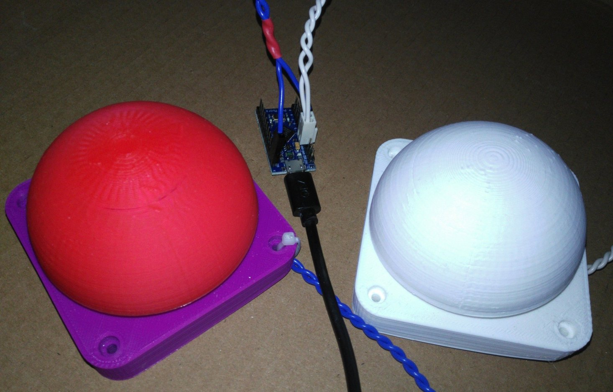
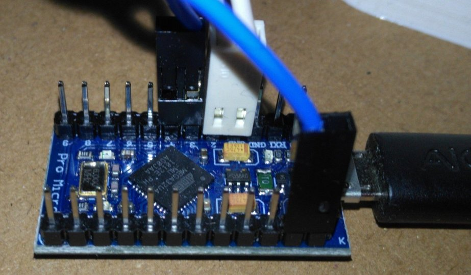

# SimpleMuteKey

Simple application to mute your microphone using Arduino Pro Micro and NicoHood/HID Library
	
In the end, this is just a custom button which emulates a key sequence.
There are two buttons available where you can map common mute shortkeys to individualy.
  
Following mappings are available to assign to buttons individual:
* 0 -> WIN + F4 (e.g. Skype)
*	1 -> CTRL + m (e.g. WebEx)
*	2 -> M (e.g. Jitsy)
*	3 -> ALT + a (e.g. Zoom)
*	4 -> F20 (e.g. Linux XF86AudioMicMute)

You need an Arduino Pro Micro or compatible and 1-2 push buttons.

As push button I did print two times the top half of slim version of https://www.thingiverse.com/thing:1406545. I'd recommend the version using 4 Cherry MX compatible switches for perfect satisfying tactile feedback.
My overall setup looks like this:

Here a detailed look at the Arduino Pro Micro.
For pin 2 and pin 3 internal pullup is used, so you only need to connect the pin to ground by the push button.

Please note, that I only had dual dupont connectors, so for blue cabeling only one contact is inserted per connector.
